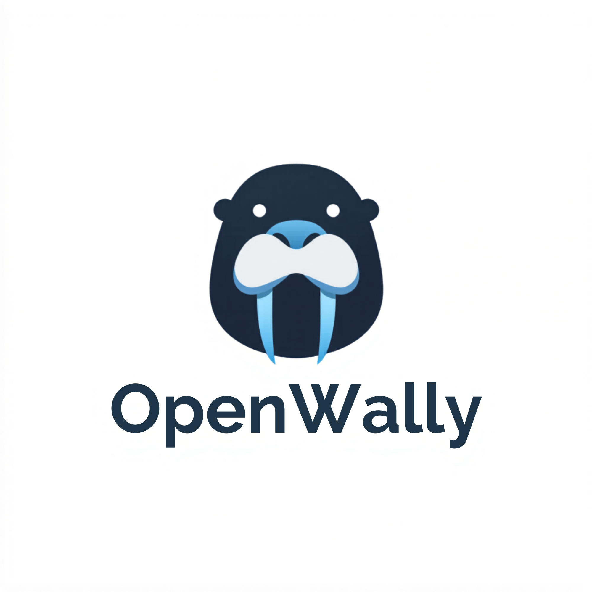

<p align="center">
  
</p>

<h1 align="center">OpenWally</h1>

<p align="center">
  An autonomous AI agent pipeline that generates complete software projects from a plain-text idea.<br/>
  Nine specialized agents collaborate sequentially, each contributing domain expertise — from requirements<br/>
  through architecture, security, UI design, code, tests, and a self-correcting UAT review cycle.
</p>

<p align="center">
  Built on <a href="https://github.com/crewaiinc/crewai">CrewAI</a> &nbsp;·&nbsp;
  Evaluated with <a href="https://github.com/UKGovernmentAIS/inspect_ai">Inspect AI</a> &nbsp;·&nbsp;
  Powered by <a href="https://www.anthropic.com">Anthropic Claude</a> or <a href="https://ollama.com">Ollama</a>
</p>

---

## How it works

You provide a project idea. The pipeline does the rest:

```
Program Manager → Software Architect → Security Architect → Engineering Manager
    → UI/UX Designer → Backend Developer → UI Developer → Code Reviewer → Quality Engineer → UAT Tester
                                                                                                    ↓
                                                                        NO-GO → Revision cycle (up to N times)
                                                                            Backend Dev → UI Dev → QA → UAT
                                                                                                          ↓
                                                                                                        GO → scaffold & git
```

Every agent appends a **Testing Notes** section to its artifact — domain-specific test cases consumed by the Quality Engineer and UAT Tester. Security test cases come from the Security Architect, API contract tests from the Software Architect, interaction state tests from the UI Designer, and implementation edge cases from the developers.

The **Code Reviewer** reads every source file after both developers finish, cross-references the code against the architecture contracts, security requirements, and task definitions of done, and produces a structured report before QA runs. This closes the gap between what was designed and what was actually built.

If UAT returns a NO-GO verdict, a targeted revision crew automatically fixes the defects and re-evaluates — up to a configurable limit.

### Agent roles and models

| Agent | Default model | Responsibility |
|---|---|---|
| Program Manager | claude-opus-4-7 | Requirements doc, acceptance criteria, testing setup notes |
| Software Architect | claude-opus-4-7 | System design, API contracts, integration test scenarios |
| Security Architect | claude-opus-4-7 | STRIDE threat model, security requirements, concrete security test cases |
| Engineering Manager | claude-sonnet-4-6 | Dev task list, testable definition-of-done per task |
| UI/UX Designer | claude-opus-4-7 | Wireframes, design tokens, interaction state and form validation tests |
| Backend Developer | claude-sonnet-4-6 | Python source code, implementation edge case notes |
| UI Developer | claude-opus-4-7 | React + TypeScript + Tailwind + shadcn/ui, component test notes |
| Code Reviewer | claude-opus-4-7 | Reads actual source files, verifies architecture/security/task compliance |
| Quality Engineer | claude-sonnet-4-6 | Full test suite implementing every agent's Testing Notes + code review findings |
| UAT Tester | claude-haiku-4-5 | Pass/fail against all ACs, SRs, architecture compliance, UI fidelity |

Every model is independently overridable via environment variable and supports both Claude and Ollama — see [Configuration](#configuration).

---

## Prerequisites

- Python 3.11+
- [uv](https://docs.astral.sh/uv/getting-started/installation/) — Python package manager
- [Node.js](https://nodejs.org/) 18+ and `npm` — for the generated frontend
- [git](https://git-scm.com/)
- An Anthropic API key **or** [Ollama](https://ollama.com) running locally

Optional, for pushing to GitHub:
- [GitHub CLI (`gh`)](https://cli.github.com/)

---

## Installation

```bash
git clone https://github.com/<you>/openwally.git
cd openwally

uv venv
source .venv/bin/activate      # Windows: .venv\Scripts\activate
uv pip install -e .

cp .env.example .env
# Edit .env — set ANTHROPIC_API_KEY or configure Ollama models
```

---

## Usage

### Run from an idea file (recommended)

Write your project idea in a `.md` or `.txt` file:

```markdown
# My Project Idea

Build a SaaS expense tracker. Users can submit expenses with a category,
amount, and receipt photo. Managers can approve or reject submissions.
The app should send email notifications on status changes and export
approved expenses as CSV.
```

```bash
openwally run --spec-file idea.md
```

### Run from an inline string

```bash
openwally run --spec "Build a URL shortener with per-link analytics and a React dashboard"
```

### All options

| Flag | Default | Description |
|---|---|---|
| `--spec-file FILE` | — | Path to a `.md` or `.txt` file with the project spec |
| `--spec TEXT` | — | Project idea as an inline string |
| `--name NAME` | derived from spec | Folder name for the generated project |
| `--output-dir DIR` | `./projects` | Parent directory for generated projects |
| `--mode MODE` | `autonomous` | Human-in-the-loop level — see below |
| `--review-depth DEPTH` | `standard` | Code review thoroughness — see below |
| `--max-revisions N` | `2` | Max UAT revision cycles on NO-GO verdict (`0` to disable) |

---

## Human-in-the-loop modes

Control how much you want to be involved using `--mode`:

| Mode | Behaviour | When to use |
|---|---|---|
| `autonomous` | Fully hands-off, no pauses (default) | Unattended runs, CI/CD |
| `milestone` | Pauses after **requirements**, **UI design**, and **tests** for your review | First run on a new idea — review before costly steps lock in |
| `interactive` | Pauses after **every agent** for your feedback | Tight control, exploration, debugging |

```bash
# Review requirements and UI design before coding starts
openwally run --spec-file idea.md --mode milestone

# Review every agent's output
openwally run --spec-file idea.md --mode interactive

# Fully autonomous with up to 3 self-correction cycles
openwally run --spec-file idea.md --max-revisions 3
```

When a pause occurs, CrewAI prints the agent's output and prompts you for feedback. Type your notes and press Enter — the agent incorporates your feedback before the next agent runs. Press Enter with no input to accept as-is.

---

## Code review depth

Control how exhaustively the Code Reviewer reads the generated source with `--review-depth`:

| Depth | Behaviour | Best for |
|---|---|---|
| `off` | Skip code review entirely — agent not added to pipeline | Fast/cheap runs, iteration |
| `standard` | Risk-prioritised: reads auth, API handlers, security code, data models, and API hooks in full; skims utilities (default) | Most runs — catches ~90% of real issues at ~30% of thorough cost |
| `thorough` | Reads every source file in both manifests exhaustively | Pre-release, security-sensitive projects |

```bash
# Default — risk-prioritised
openwally run --spec-file idea.md

# Skip review entirely (fastest)
openwally run --spec-file idea.md --review-depth off

# Read every file
openwally run --spec-file idea.md --review-depth thorough

# Combine with other flags
openwally run --spec-file idea.md --review-depth thorough --mode milestone --max-revisions 3
```

**Standard depth read order** (highest risk first):
1. Auth, token, JWT, session, middleware, permission, password, crypto files
2. API route/endpoint handlers
3. Input validation and sanitisation modules
4. Data model definitions
5. Frontend hooks that call the backend API
6. *(Skipped)* Utilities, config, components, test files, lock files

---

## UAT revision loop

If the UAT Tester returns a **NO-GO** verdict, OpenWally automatically runs a targeted revision cycle:

```
UAT: NO-GO
  → Backend Developer reads the UAT report, fixes backend defects
  → UI Developer reads the UAT report, fixes frontend defects
  → Quality Engineer re-tests the fixed code
  → UAT Tester re-evaluates (focused on prior failures + regression check)
  → GO? Done. Still NO-GO? Repeat up to --max-revisions times.
```

Each revision cycle saves its own artifacts (`revision_1_backend_fixes.md`, `revision_1_uat_report.md`, etc.) so you have a full audit trail. The scaffold step always runs at the end — even on a final NO-GO — so the project is always written to disk for manual fixes.

---

## Output

The generated project is written to `<output-dir>/<project-name>/`:

```
my-project/
├── src/my_project/          # Python backend source
├── tests/                   # pytest suite (implements all Testing Notes from every agent)
│   ├── conftest.py
│   └── test_*.py
├── frontend/                # React + TypeScript + Tailwind frontend
│   ├── src/
│   │   ├── components/ui/   # shadcn/ui primitive wrappers
│   │   ├── components/      # feature components
│   │   ├── pages/           # one file per route
│   │   ├── hooks/           # API hooks
│   │   └── types/api.ts     # TypeScript types matching backend contracts
│   ├── package.json
│   ├── vite.config.ts
│   └── tailwind.config.ts
├── deps.txt                 # Python packages (consumed by uv)
├── pyproject.toml           # Created by uv init
├── uv.lock
├── .venv/                   # Python virtual environment
├── .gitignore
└── .harness-docs/           # Full pipeline audit trail
    ├── 1_requirements.md
    ├── 2_architecture.md
    ├── 3_security.md
    ├── 4_tasks.md
    ├── 5_ui_design.md
    ├── 6_implementation_manifest.md
    ├── 7_ui_manifest.md
    ├── 8_code_review.md
    ├── 9_test_plan.md
    ├── 10_uat_report.md
    └── revision_*/          # Present only if revision cycles ran
```

After the pipeline finishes, OpenWally prints the commands to push your project to GitHub:

```bash
gh repo create my-project --private --source=./projects/my-project --push
```

---

## Running the generated project

```bash
cd projects/my-project

# Backend
uv run uvicorn src.my_project.main:app --reload

# Frontend (second terminal)
cd frontend && npm run dev
```

---

## Configuration

All model assignments can be overridden in `.env`. Every role independently supports either a **Claude model** or a **local Ollama model** — mix and match freely.

### All Claude (default — highest quality)

```dotenv
ANTHROPIC_API_KEY=sk-ant-...

PM_MODEL=claude-opus-4-7
ARCHITECT_MODEL=claude-opus-4-7
SECURITY_MODEL=claude-opus-4-7
EM_MODEL=claude-sonnet-4-6
UI_DESIGNER_MODEL=claude-opus-4-7
UI_DEV_MODEL=claude-opus-4-7
DEV_MODEL=claude-sonnet-4-6
QA_MODEL=claude-sonnet-4-6
UAT_MODEL=claude-haiku-4-5-20251001
```

### Hybrid — Ollama for lighter roles (cost saving)

Keep Claude for high-reasoning roles and use free local models for pass/fail evaluation:

```dotenv
ANTHROPIC_API_KEY=sk-ant-...
OLLAMA_BASE_URL=http://localhost:11434

QA_MODEL=ollama/llama3.2
UAT_MODEL=ollama/mistral
```

### Fully local — no API key required

```dotenv
OLLAMA_BASE_URL=http://localhost:11434

PM_MODEL=ollama/llama3.2
ARCHITECT_MODEL=ollama/llama3.2
SECURITY_MODEL=ollama/mistral
EM_MODEL=ollama/llama3.2
UI_DESIGNER_MODEL=ollama/llama3.2
UI_DEV_MODEL=ollama/llama3.2
DEV_MODEL=ollama/mistral
QA_MODEL=ollama/llama3.2
UAT_MODEL=ollama/llama3.2
```

### Ollama setup

```bash
# Install: https://ollama.com
ollama pull llama3.2
ollama pull mistral
ollama list   # confirm models are ready
```

---

## Evaluation harness

[Inspect AI](https://github.com/UKGovernmentAIS/inspect_ai) tasks in `eval/` measure pipeline output quality:

| Task | What it checks |
|---|---|
| `eval_requirements_completeness` | All six sections present, ≥3 numbered FRs and ACs |
| `eval_security_coverage` | STRIDE categories, ≥2 numbered SRs, risk ratings |
| `eval_uat_verdict` | Pipeline produces a clear GO or NO-GO verdict |

```bash
inspect eval eval/pipeline_eval.py --model anthropic/claude-sonnet-4-6
inspect view   # browse results in the web UI
```

---

## Project structure

```
openwally/
├── src/openwally/
│   ├── crew.py              # OpenWallyCrew + RevisionCrew (@CrewBase)
│   ├── main.py              # CLI — --mode, --max-revisions, revision loop
│   ├── scaffolding.py       # uv + npm + git post-pipeline setup
│   ├── config/
│   │   ├── agents.yaml      # Roles, goals, backstories, model assignments
│   │   └── tasks.yaml       # Task descriptions, Testing Notes instructions, context chains
│   └── tools/
│       ├── artifact_writer.py      # Writes pipeline docs to .harness-docs/
│       ├── artifact_reader.py      # Reads pipeline docs (reviewer + revision agents)
│       ├── project_file_writer.py  # Writes source files into the generated project
│       └── project_file_reader.py  # Reads source files (code reviewer + QA)
├── eval/
│   ├── pipeline_eval.py     # Inspect AI task definitions
│   └── scorers.py           # Custom quality scorers
└── assets/
    └── logo.png
```

---

## Publishing to GitHub

See [UPLOAD.md](UPLOAD.md) for a step-by-step guide to safely uploading this project to your private GitHub repository.

---

## License

MIT
